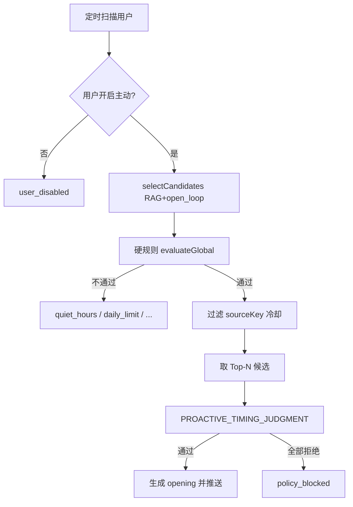

# 主动对话规则契约

本文档定义主动对话（Proactive Opening）的**硬规则**与 **LLM 时机判断**边界。硬规则在代码中由 `ProactiveHardRuleEvaluator` 执行，LLM 判断由 `ProactivePolicyGate` 在通过硬规则后对 Top-N 候选执行。

## 决策流水线



## 硬规则（代码强制执行，不交给 LLM）

| 规则 | 配置项 | 默认 | 跳过原因码 |
|------|--------|------|------------|
| 全局开关 | `hoshi.proactive.enabled` | `true` | `disabled` |
| 用户开关 | 用户偏好 `enabled` | - | `user_disabled` |
| 静默时段 | `quiet-hours-start` / `quiet-hours-end` | 23–8 | `quiet_hours` |
| 每日上限 | `daily-limit` | 3 | `daily_limit` |
| 最小空闲 | `min-idle-minutes`（距上次用户消息） | 30 | `min_idle` |
| 会话冷却 | `session-cooldown-minutes`（距上次主动） | 180 | `session_cooldown` |
| 来源去重 | `source-cooldown-hours` + `recentSourceKeys` | 24h | 候选被过滤，不计入 Top-N |

硬规则**全部通过**后，才对 `timing-judgment-top-n`（默认 2）个候选调用 `PROACTIVE_TIMING_JUDGMENT`。

## LLM 时机判断（软规则）

仅在硬规则通过后执行，输入包含：

- 候选 `hint`、来源类型、优先级
- 完整 `buildProactiveCognitionContext`（近期对话、摘要、RAG 记忆）
- 距上次用户消息 / 上次主动的分钟数（供模型参考，**不再**作为硬拦截）

模型输出 `shouldTrigger` + `confidence`，需满足 `proactiveTimingJudgmentMinConfidence`（见 `HoshiAiProperties`）。

## 候选来源

`ProactiveCandidateSelector`：

1. `buildChatContext().shortMemories()` 中符合类别的记忆（RAG 对齐）
2. 会话摘要 `openLoops`

按 `rankPriority` 排序后进入硬规则与 Top-N 流程。

## 配置参考

```yaml
hoshi:
  proactive:
    enabled: true
    min-idle-minutes: 30
    session-cooldown-minutes: 180
    daily-limit: 3
    source-cooldown-hours: 24
    quiet-hours-start: 23
    quiet-hours-end: 8
    timing-judgment-top-n: 2
```

## 相关类

- [`ProactiveHardRuleEvaluator`](../hoshi-conversation/src/main/java/com/tsukimiai/hoshi/conversation/application/proactive/ProactiveHardRuleEvaluator.java)
- [`ProactivePolicyGate`](../hoshi-conversation/src/main/java/com/tsukimiai/hoshi/conversation/application/proactive/ProactivePolicyGate.java)
- [`ProactiveCandidateSelector`](../hoshi-conversation/src/main/java/com/tsukimiai/hoshi/conversation/application/proactive/ProactiveCandidateSelector.java)
